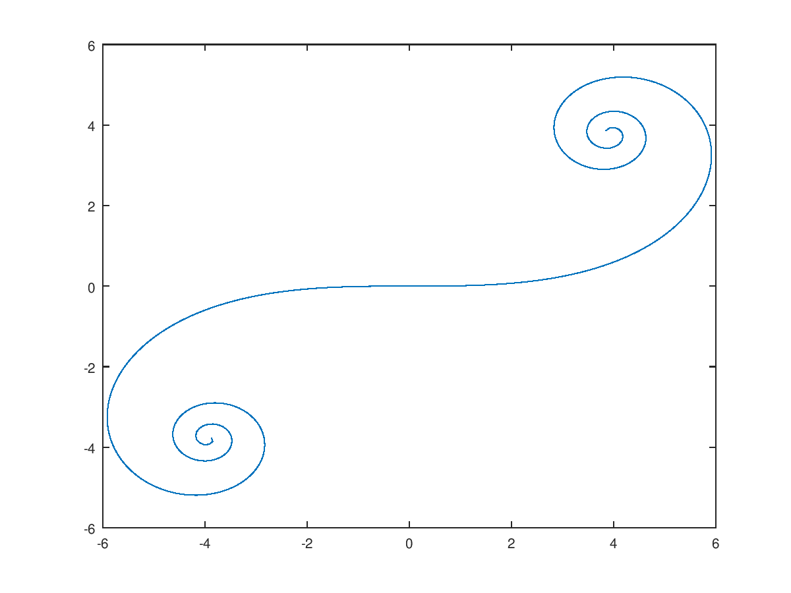
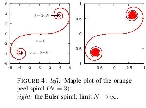
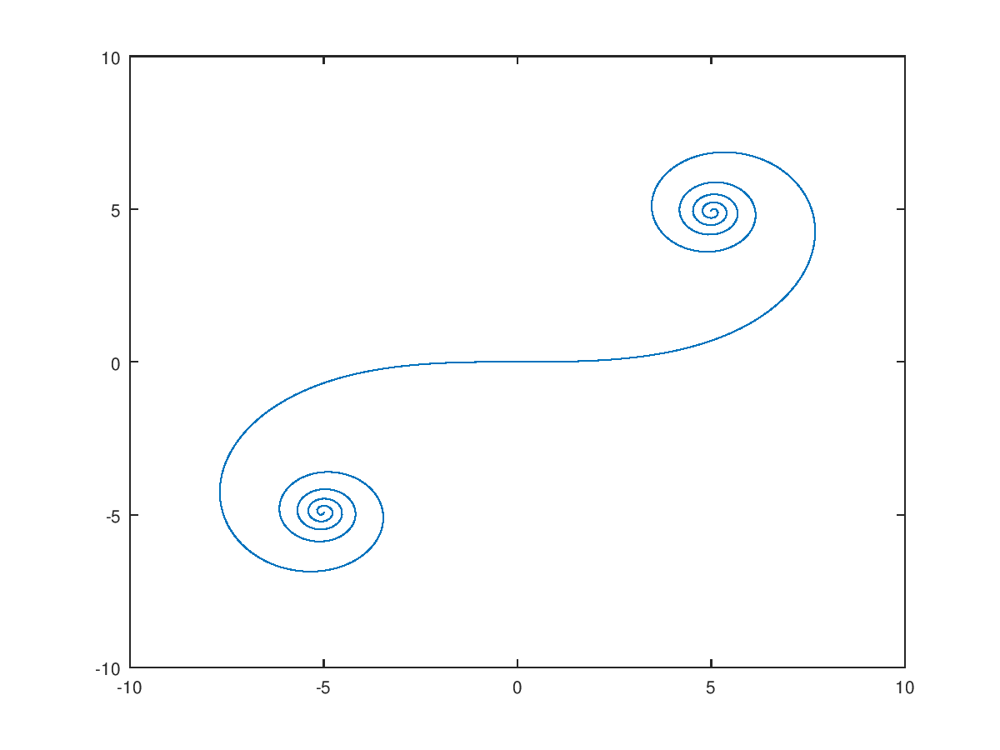

This repository uses GNU Octave to reproduce the orange peel spiral plot in the
paper 'Orange Peels And Fresnel Integrals' by Laurent Bartholdi and
Andre Henriques. The paper can be found on [arxiv](https://arxiv.org/pdf/1202.3033.pdf)
and is [included in this repository](1202.3033.pdf).

Below is a side by side comparison of a plot generated using this repository
and the plot included in the paper. Both plots use N=3 for the spiral width.
The new plot can be reproduced by running `./plot_peel_spiral.m 3` on a machine
with octave on its path.

New Plot|Original Plot
--------|-------------
|

The Octave script can generate plots for arbitrary spiral width by manipulating
the command line arguments. For N=5, the command `./plot_peel_spiral.m 5` gives the
following plot.

